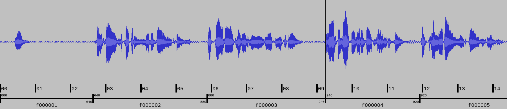

Package ``aeneas``
==================

.. automodule:: aeneas 

Goal
----

**aeneas** automatically generates a **synchronization map**
between a list of text fragments
and an audio file containing the narration of the (same) text.
In computer science this task is known as (automatically computing a) **forced alignment**.

For example, given the verses and a ``53.240s``-long audio recording
of *Sonnet I* by William Shakespeare,
**aeneas** might compute a map like the following:

.. code-block:: text

    1                                                     => [00:00:00.000, 00:00:02.640]
    From fairest creatures we desire increase,            => [00:00:02.640, 00:00:05.880]
    That thereby beauty's rose might never die,           => [00:00:05.880, 00:00:09.240]
    But as the riper should by time decease,              => [00:00:09.240, 00:00:11.920]
    His tender heir might bear his memory:                => [00:00:11.920, 00:00:15.280]
    But thou contracted to thine own bright eyes,         => [00:00:15.280, 00:00:18.800]
    Feed'st thy light's flame with self-substantial fuel, => [00:00:18.800, 00:00:22.760]
    Making a famine where abundance lies,                 => [00:00:22.760, 00:00:25.680]
    Thy self thy foe, to thy sweet self too cruel:        => [00:00:25.680, 00:00:31.240]
    Thou that art now the world's fresh ornament,         => [00:00:31.240, 00:00:34.400]
    And only herald to the gaudy spring,                  => [00:00:34.400, 00:00:36.920]
    Within thine own bud buriest thy content,             => [00:00:36.920, 00:00:40.640]
    And tender churl mak'st waste in niggarding:          => [00:00:40.640, 00:00:43.640]
    Pity the world, or else this glutton be,              => [00:00:43.640, 00:00:48.080]
    To eat the world's due, by the grave and thee.        => [00:00:48.080, 00:00:53.240]

The above map is just an abstract representation of a sync map.
In practice, the sync map will be output to a file with a precise syntax.
Currently, the following formats are supported:

#. ELAN annotation format (EAF) for research purposes,
#. SMIL for EPUB 3 ebooks with Media Overlays,
#. SBV/SRT/SUB/TTML/VTT for closed captioning,
#. JSON for consumption on the Web, and
#. "raw" AUD/CSV/SSV/TSV/TXT/XML for further processing.

Usage
-----

**aeneas** can be used via the **built-in command line tools**,
or as a **Python package** inside third-party code.

(If you do not plan to write Python code,
just proceed to the next section describing
the built-in command line tools.)

Using aeneas Built-in Command Line Tools
~~~~~~~~~~~~~~~~~~~~~~~~~~~~~~~~~~~~~~~~

**aeneas** provides the following two main command line programs:

* ``aeneas.tools.execute_task``
* ``aeneas.tools.execute_job``

.. note::

    **aeneas** contains a dozen of other programs,
    mostly useful for debugging or converting between different file formats.
    See the :ref:`libtutorial_tools` section for details.

A **Task** is a triple ``(audio file, text file, parameters)``
for which you want to compute a **single sync map file**.

.. topic:: Example

    A Task might consist of
    the audio track of a video as an MP3 file,
    its transcript written as a plain text file,
    and parameters like "output in SRT format, language is English".

.. topic:: Example

    A Task might consist of
    the audio file as an MP4/AAC file,
    the text of an ebook chapter as a XHTML file,
    and parameters like "output in SMIL format, language is Italian,
    extract text from the elements in the XHTML file with
    attribute ``id`` matching the regular expression ``f[0-9]+``".

A **Job** is a container (ZIP or TAR file, or an uncompressed directory)
including one or more Tasks;
normally a Job is handy to **batch processing multiple Tasks**
sharing the same execution parameters.

.. topic:: Example

    A Job might consists of fifteen Tasks,
    each corresponding to an XHTML page inside a
    Fixed-Layout EPUB 3 file.
    Fifteen SMIL files,
    one for each Task (i.e., XHTML page)
    will be produced.

Run the above commands without arguments to get an **help message**.
**aeneas** includes some example input files which cover common use cases,
enabling the user to run **live examples**.

The help message for ``aeneas.tools.execute_job`` reads:

.. literalinclude:: _static/execute_job_help.txt
    :language: text

The paths in the example might differ, depending on the installation location of **aeneas**.
Usually, each command line in the ``EXAMPLES`` section
can be copied-and-pasted to see the corresponding example running live.

The help message for ``aeneas.tools.execute_task`` reads:

.. literalinclude:: _static/execute_task_help.txt
    :language: text

The ``--examples`` switch prints a list of **common** built-in live examples:

.. literalinclude:: _static/execute_task_examples.txt
    :language: text

Similarly, the ``--examples-all`` switch prints a list
of more than twenty built-in examples,
covering **more peculiar input/output/parameter combinations**.

For example, ``--example-srt`` produces the following output:

.. code-block:: text

    $ python -m aeneas.tools.execute_task --example-srt
    [INFO] Running example task with arguments:
      Audio file:    aeneas/tools/res/audio.mp3
      Text file:     aeneas/tools/res/subtitles.txt
      Config string: task_language=eng|is_text_type=subtitles|os_task_file_format=srt
      Sync map file: output/sonnet.srt
    [INFO] Creating task...
    [INFO] Creating task... done
    [INFO] Executing task...
    [INFO] Executing task... done
    [INFO] Creating output sync map file...
    [INFO] Creating output sync map file... done
    [INFO] Created file 'output/sonnet.srt'

A new file, named ``sonnet.srt``
is created in the ``output/`` subdirectory
of the current working directory.
This SRT file contains the subtitles read from ``subtitles.txt``,
automatically aligned with the audio file ``audio.mp3``.

Example shortcuts also print the **actual parameters**
which are hidden behind the ``--example-srt`` shortcut.
Thus, the above example is equivalent to:

.. code-block:: text

    $ python -m aeneas.tools.execute_task aeneas/tools/res/audio.mp3 aeneas/tools/res/subtitles.txt "task_language=eng|is_text_type=subtitles|os_task_file_format=srt" output/sonnet.srt
    [INFO] Validating config string (specify --skip-validator to bypass)...
    [INFO] Validating config string... done
    [INFO] Creating task...
    [INFO] Creating task... done
    [INFO] Executing task...
    [INFO] Executing task... done
    [INFO] Creating output sync map file...
    [INFO] Creating output sync map file... done
    [INFO] Created file 'output/sonnet.srt'

Note that a validation of the input files and parameters is performed as the first step.
If incorrect or incomplete parameters are specified, an error message is printed:

.. code-block:: text

    $ python -m aeneas.tools.execute_task aeneas/tools/res/audio.mp3 aeneas/tools/res/subtitles.txt "task_language=eng|is_text_type=subtitles" output/sonnet.srt
    [INFO] Validating config string (specify --skip-validator to bypass)...
    [ERRO] The given config string is not valid:
    Errors:
      Required parameter 'os_task_file_format' not set.

    $ python -m aeneas.tools.execute_task aeneas/tools/res/audio.mp3 aeneas/tools/res/subtitles.txt "task_language=eng|is_text_type=subtitles|os_task_file_format=srt" /foo/bar/sonnet.srt
    [ERRO] Unable to create file '/foo/bar/sonnet.srt'
    [ERRO] Make sure the file path is written/escaped correctly and that you have write permission on it

To learn more, please continue with the :ref:`clitutorial`.

Using aeneas As A Python Package
~~~~~~~~~~~~~~~~~~~~~~~~~~~~~~~~

Please consult the :ref:`libtutorial`.

Topics
------

.. toctree::
    :maxdepth: 3

    clitutorial
    libtutorial
    changelog

Indices and Tables
------------------

* :ref:`genindex`
* :ref:`modindex`
* :ref:`search`
