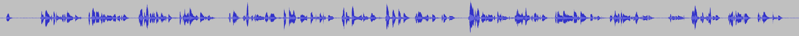
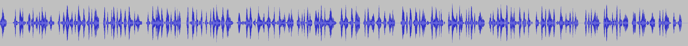

# How Does This Thing Work?

## One Word Explanation

Math.

## One Sentence Explanation

Using the Sakoe-Chiba Band Dynamic Time Warping (DTW) algorithm
to align the Mel-frequency cepstral coefficients (MFCCs)
representation of the given (real) audio wave and
the audio wave obtained by synthesizing the text fragments
with a TTS engine, eventually mapping
the computed alignment back onto the (real) time domain.


## Extended Explanation

### The Forced Alignment Problem

It might be useful to remind that **aeneas** is mainly a
[**forced aligner (FA)**](https://www.isip.piconepress.com/projects/speech/software/tutorials/production/fundamentals/v1.0/section_04/s04_04_p01.html),
that is, a software that takes an audio file and a text file divided into fragments as its input,
and it outputs a synchronization map,
that is, it automatically associates to each text fragment the time interval (in the audio file)
when that text fragment is spoken.
The following waveform illustrates the concept:


```
Sonnet I                                              => [00:00:00.000, 00:00:02.640]
From fairest creatures we desire increase,            => [00:00:02.640, 00:00:05.880]
That thereby beauty's rose might never die,           => [00:00:05.880, 00:00:09.240]
But as the riper should by time decease,              => [00:00:09.240, 00:00:11.920]
His tender heir might bear his memory:                => [00:00:11.920, 00:00:15.280]
...
```

Typical applications of FA
include [**Audio-eBooks**](http://www.readbeyond.it/audioebooks.html)
where audio and text are synchronized,
or **closed captioning** for videos.

FA systems are handy because they output the synchronization map **automatically**,
without requiring any human intervention.
In fact, manually aligning audio and text is a **painfully tiring task**,
prone to fatigue errors, and it requires **trained operators**
who understand the language being spoken.
FA software can do the job **effortlessly**, while maintaining a good **quality**
of the alignment output, often indistinguishable from a manual alignment.

### (TTS+DTW)-Based Aligner

Most [force alignment tools](https://github.com/pettarin/forced-alignment-tools)
are based on automated speech recognition (ASR) techniques.
ASRs systems, used as aligners,
first try to recognize what the speaker says,
then they align the recognized text with the ground truth text,
producing the final text-to-audio synchronization map.

Unlike ASRs,
**aeneas** uses a **more classic, signal-processing-based approach**,
called [**Dynamic Time Warping**](https://en.wikipedia.org/wiki/Dynamic_time_warping) (DTW)
leveraging text-to-speech (TTS) synthesis.

To compute a synchronization map,
the **aeneas** performs the steps described below.

#### Step 1: convert real audio to mono

The first step consists in converting
the given audio file `R` (real),
containing the narration of the text by a human being,
obtaining a mono WAVE file `C`, for example:



Since the difference in timings
between `R` (real) and `C` (converted)
is assumed to be negligible,
in the rest of this explanation we will directly use
`R` (real) for clarity,
but you must bear in mind that
**aeneas** actually operates on `C`,
that is, the mono WAVE version of `R`.

**NOTE**:
The above observation is true
for all the modern audio formats,
considered at "file level".
However this might not be always true
when a given audio file in a non-WAVE format
is consumed by an application,
due to the implementation details of the application.
For example, Web browsers
might have incorrect timings when seeking
MP3 VBR files through the `<audio>` element.

#### Step 2: synthesize text

The given list of text fragments
`F = (f_1, f_2, ..., f_q)`
is synthesized using a text-to-speech system (TTS).

This step is the only step in the TTS+DTW method
that depends on the language,
since the TTS audio output is created from text
applying rules that vary from language to language.
However, this dependence is **weaker** than with ASR-based methods,
and it turns out that, for the forced alignment,
the TTS does not need to sound natural,
it just needs to produce intelligible audio.

This step produces:

1. a mono WAVE file `S` (synthesized); and
2. a text-to-synt-time map `M1`,
   associating each text fragment `f_i` in `F`
   to the time interval `s_i` in `S`
   containing the audio of the synthesized text `f_i`.

For example, let the input text `F` be:

```
F = [
  f_1  = "Sonnet I"
  f_2  = "From fairest creatures we desire increase,"
  f_3  = "That thereby beauty's rose might never die,"
  f_4  = "But as the riper should by time decease,"
  f_5  = "His tender heir might bear his memory:"
  ...
  f_15 = "To eat the world's due, by the grave and thee."
]
```

We might get the synthesized wave `S`:



and the corresponding  map `M1`:

```
M1 = [
  f_1  -> s_1  = [ 0.000,  0.638]
  f_2  -> s_2  = [ 0.638,  2.930]
  f_3  -> s_3  = [ 2.930,  5.212]
  f_4  -> s_4  = [ 5.212,  7.362]
  f_5  -> s_5  = [ 7.362,  9.369]
  ...
  f_15 -> s_15 = [31.834, 34.697]
]
```

#### Step 3: compute MFCC from real and synthesized audio

Next, we compute an abstract matrix representation
for each of the two audio signals `R` and `S`, called
[Mel-frequency cepstral coefficients](https://en.wikipedia.org/wiki/Mel-frequency_cepstrum) (MFCC).

The MFCC capture the overall "shape" of the audio signal,
neglecting local details like the color of the voice.

After this step, we have two new objects:

1. the `MFCC_R` matrix, of size `(k, n)`,
   containing the MFCC coefficients for the real audio file `R`;
2. the `MFCC_S` matrix, of size `(k, m)`,
   containing the MFCC coefficients for the synthesized audio file `S`.

Each column of the matrix,
also called _frame_,
corresponds to a sub-interval of the audio file,
all with the same length, for example 40 milliseconds.
So, if the audio file `R` has length 10 seconds,
`MFCC_R` will have 250 columns,
the first corresponding to the interval between `0.000` and `0.040`,
the second corresponding to the interval `[0.040, 0.080]`,
and so on.
Since in general the audio files `R` and `S` have different lengths,
the corresponding `MFCC_R` and `MFCC_S` matrices will have a different number of columns,
let's say `n` and `m` respectively.

Both matrices have `k` rows, each representing one MFCC coefficient.
The first coefficient (row `0`) of each frame
represents the spectral log power of the audio in that frame.

For both `R` and `S`, we can map a time instant in the audio file
to the corresponding frame index in `MFCC_R` or `MFCC_S`.
Moreover, we can map back a frame index in `MFCC_R` or `MFCC_S` to
the corresponding interval in `R` or `S`.

#### Step 4: compute DTW

The next step consists in computing the DTW
between the two MFCC matrices.

First, a cost matrix `COST` of size `(n, m)`
is computed by taking the dot product `*`
of the two MFCC matrices:

```
COST[i][j] = MFCC_R[:][i] * MFCC_S[:][j]
```

Then, the DTW algorithm is run over the cost matrix to find
the minimum cost path transforming `S` into `R`.

Since computing this algorithm over the full matrix would be too expensive,
requiring space (memory) and time `Theta(nm)`,
only a stripe (band) around the main diagonal is computed,
and the DTW path is constrained to stay inside this stripe.
The width `d` of the stripe, the so-called margin,
is a parameter adjusting the tradeoff between
the "quality" of the approximation produced and
the space/time `Theta(nd)` to produce it.

This approach is called
_Sakoe-Chiba Band (approximation of the exact) Dynamic Time Warping_,
because, in general, the produced path is not the minimum cost path,
but only an approximation of it.
However, given the particular structure of the forced alignment task,
the Sakoe-Chiba approximation often returns the optimal solution,
when the margin `d` is set suitably large to "absorb" the variation of speed
between the real audio and the synthesized audio, but small enough
to make the computation fast enough.

The output of this step is a synt-frame-index-to-real-frame-index map `M2`,
which associates a column index in `MFCC_R` to each column index in `MFCC_S`.
In other words, it maps the synthesized time domain back onto the real time domain.
In our example:

```
M2 = [
    0  -> 10
    1  -> 11
    2  -> 12
    3  -> 14
    ...
    15 -> 66
    16 -> 67
    ...
    m  -> n
]
```

Thanks to the implicit frame-index-to-audio-time correspondence,
the `M2` map can be viewed as mapping intervals in the synthesized audio
into intervals of the real audio:

```
M2 = [
    [0.000, 0.040] -> [0.000, 0.440]
    [0.040, 0.080] -> [0.480, 0.520]
    [0.080, 0.120] -> [0.520, 0.560]
    [0.120, 0.160] -> [0.600, 0.640]
    ...
    [0.600, 0.640] -> [2.640, 2.680]
    [0.640, 0.680] -> [2.680, 2.720]
    ...
]
```

#### Step 5: mapping back to the real time domain

The last step consists in composing the two maps `M2` and `M1`,
obtaining the desired map `M` that
associates each text fragment `f` to the corresponding interval
in the real audio file:

```
M[f] = [ M2[(M1[f].begin)].begin, M2[(M1[f].end)].begin ]
```

Continuing our example, for the first text fragment we have:

```
f      = f_1                # "Sonnet 1"

M1[f]  = [0.000, 0.638]     # in the synthesized audio
       = [0, 15]            # as MFCC_S indices

M2[0]  = 0                  # as MFCC_R index
       = [0.000, 0.040]     # as interval in the real audio
M2[15] = 66                 # as MFCC_R index
       = [2.640, 2.680]     # as interval in the real audio

M[f_1] = [0.000, 2.640]     # in the real audio
```

Repeating the above for each fragment,
we obtain the map `M` for the entire text:

```
M = [
    "Sonnet I"                                       -> [ 0.000,  2.640]
    "From fairest creatures we desire increase,"     -> [ 2.640,  5.880]
    "That thereby beauty's rose might never die,"    -> [ 5.880,  9.240]
    "But as the riper should by time decease,"       -> [ 9.240, 11.920]
    "His tender heir might bear his memory:"         -> [11.920, 15.280]
    ...
    "To eat the world's due, by the grave and thee." -> [48.080, 53.240]
]
```


**NOTE**:
The final output map `M` has time values which are
multiples of the MFCC frame size (MFCC window shift),
for example 40 milliseconds in the example above.
This effect is due to the **discretization of the audio signal**.
The user can reduce this effect by setting a smaller MFCC window shift,
say to 5 milliseconds, at the cost of increasing the demand of
computation resources (memory and time).
The default settings of **aeneas** are fine for aligning audio and text
when the text fragments have paragraph, sentence, or sub-sentence granularity.
For **word-level granularity**,
the user might want to decrease the MFCC window shift parameter.
Please consult the
[Command Line Tutorial](http://www.readbeyond.it/aeneas/docs/clitutorial.html)
in the documentation for further advice.


